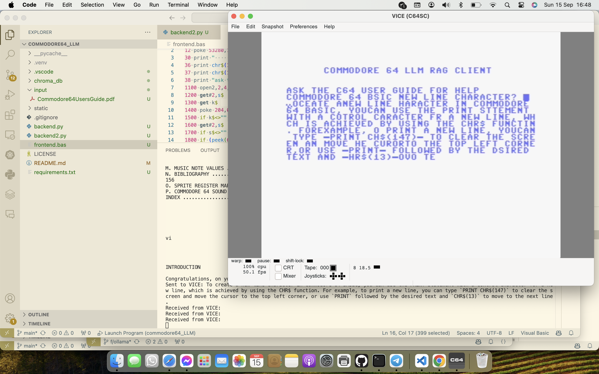

# commodore64_LLM

## Setup the environment

### Configure the serial port

```bash
socat -d -d pty,raw,echo=0 pty,raw,echo=0
```

## Sample file

Sample file is from here: https://pickledlight.blogspot.com/p/commodore-64-guides.html



