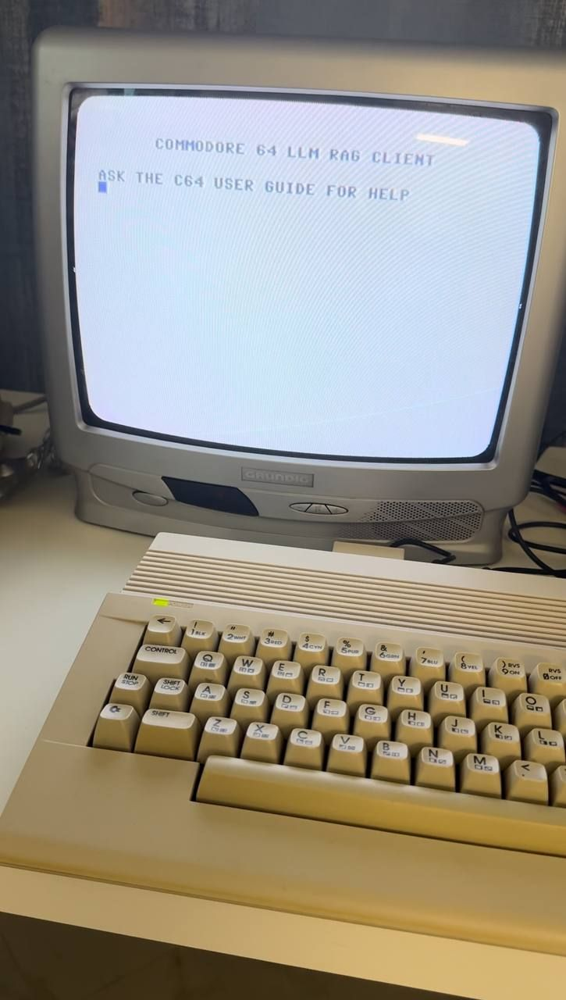
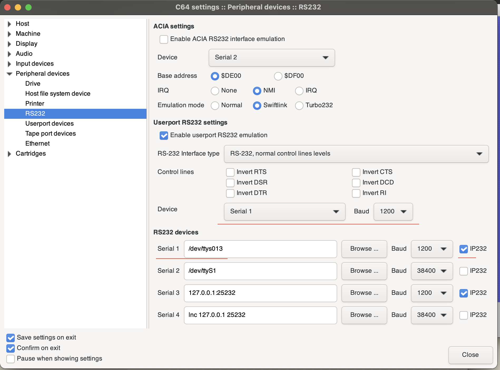

# commodore64 LLM RAG application with Python backend

Commodore 64 frontend, and python backend to query the latest free Commodore 64 User Guide into RAG architecture using LLM ChromaDB.

OpenAI Token required to run. 



## Executing the C64 application in emulaltor


The application sends the data to the Python environment without errors, but 1 or 1 letter is missing during the return. 
## Setup the environment

### Configure the serial port

```bash
socat -d -d pty,raw,echo=0 pty,raw,echo=0
```

Two serial devices will appear, one to be typed into the emulator and the other into the Python code.

### Setup the C64 emulator



## Sample file

Sample file is from here: https://pickledlight.blogspot.com/p/commodore-64-guides.html

## Connection test

There is a test.py file to test the connection between the C64 emulator and the Python environment. 


